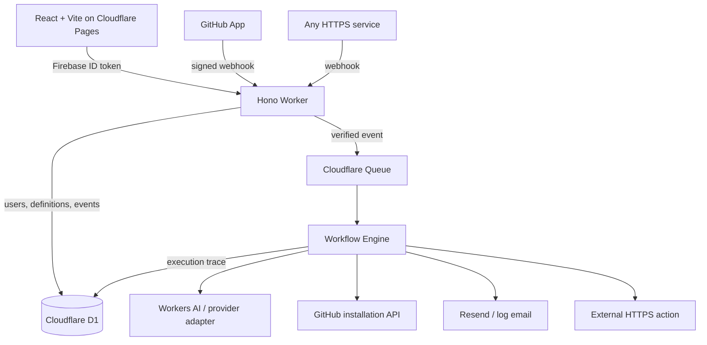

# Trigg

**Automate what happens next.**

Trigg is an open-source, AI-powered automation platform for developers. It composes events, processing, safe logic, and actions into observable workflows:

```text
TRIGGER → INPUT → AI / PROCESSING → LOGIC → ACTION
```

The flagship workflow reviews a GitHub pull request with AI, branches on material risk, comments on the PR, and emails the team—but the engine is generic. Webhooks, manual events, transforms, HTTP calls, issue creation, and custom node definitions use the same versioned workflow model.

## Product tour

```text
PR Opened
   ↓
Trigg verifies and queues the event
   ↓
AI reviews the change → Risk = 82
   ↓
Condition selects the high-risk branch
   ↓
PR comment posted + developer emailed
   ↓
Inputs, output, latency, retries, model, and tokens visible in Trigg
```

The web app includes a landing page, Firebase login, dashboard, draggable React Flow builder, node search/settings, test runs, integration status, execution history, per-node JSON inspection, and AI usage.

## Features

- Generic registry-driven trigger, AI, logic, and action nodes
- Immutable workflow versions and cycle-safe DAG validation
- Safe `{{node.field}}` interpolation and comparison expressions without `eval()`
- Firebase Google/GitHub authentication with owner-scoped D1 queries
- Multi-tenant GitHub App installations and short-lived installation tokens
- HMAC webhook verification, delivery idempotency, Queues, retries, and a dead-letter queue
- Workers AI plus deterministic credential-free mock AI
- Structured AI code review output validated with Zod
- Resend and log-only email providers
- GitHub PR comments and issue creation using the current installation—not a developer PAT
- HTTPS actions with timeout, redirect denial, and private-network checks
- Execution/node logs, AI tokens, model/provider, duration, and estimated cost
- Daily application limits and mock mode

## Architecture



The Worker acknowledges GitHub only after signature verification, idempotent event persistence, and queue publication. It never performs a full workflow in the webhook request.

## Repository

```text
apps/
  web/                 React, Vite, React Flow application
  worker/              Hono Worker and D1 migrations
packages/
  shared/              contracts, schemas, node registry, templates
  workflow-engine/     DAG validation, interpolation, branching, execution
  integrations/        GitHub App, email, HTTP safety
  ai/                  AI provider abstraction and structured outputs
  ui/                  shared design tokens
docs/                  GitHub App and security guides
fixtures/              realistic GitHub events
scripts/               development seed data
```

## Quick start

Requires Node 22+ and pnpm 10+.

```bash
pnpm install
Copy-Item apps/worker/.dev.vars.example apps/worker/.dev.vars
Copy-Item apps/web/.env.example apps/web/.env.local
pnpm db:migrate:local
pnpm dev
```

On macOS/Linux, use `cp` instead of `Copy-Item`. Open `http://localhost:5173`. Mock mode uses the local identity `developer@trigg.local`, deterministic AI review output, fixtures, and log-only email. The Worker runs at `http://localhost:8787`.

Optional development seed:

```bash
pnpm --filter @trigg/worker exec wrangler d1 execute trigg-db --local --config ../../wrangler.jsonc --file ../../scripts/seed.sql
```

## Environment variables

Browser-safe variables (`apps/web/.env.local`):

- `VITE_API_URL`
- `VITE_TRIGG_MOCK_MODE`
- `VITE_FIREBASE_API_KEY`
- `VITE_FIREBASE_AUTH_DOMAIN`
- `VITE_FIREBASE_PROJECT_ID`
- `VITE_FIREBASE_APP_ID`
- `VITE_GITHUB_URL`

Worker variables/secrets:

- `ENVIRONMENT`, `TRIGG_MOCK_MODE`, `ALLOWED_ORIGINS`, `WEB_URL`
- `FIREBASE_PROJECT_ID`
- `GITHUB_APP_ID`, `GITHUB_APP_SLUG`, `GITHUB_CLIENT_ID`, `GITHUB_CLIENT_SECRET`
- `GITHUB_PRIVATE_KEY`, `GITHUB_WEBHOOK_SECRET`
- `AI_MODEL`; optional provider keys `GEMINI_API_KEY`, `MISTRAL_API_KEY`
- `RESEND_API_KEY`, `EMAIL_FROM`
- `FREE_DAILY_RUN_LIMIT`, `FREE_DAILY_AI_LIMIT`

Never prefix a secret with `VITE_`; Vite embeds those values in browser assets.

## Firebase setup

1. Create a Firebase project and a Web App.
2. Enable Authentication providers **Google** and **GitHub**. For Firebase's GitHub provider, create a separate GitHub OAuth App and copy its client ID/secret into Firebase.
3. Add `localhost` and `trigg.pages.dev` to Firebase authorized domains.
4. Put the public Web App config in `apps/web/.env.local` / Cloudflare Pages environment variables.
5. Set the Worker `FIREBASE_PROJECT_ID`. The Worker verifies the ID token issuer, audience, and Google-hosted signing key before finding/creating the Trigg user.

Firebase GitHub login answers “who is this user?” The GitHub App answers “which repositories may Trigg access?”

## GitHub App and webhooks

Follow [docs/GITHUB_APP.md](docs/GITHUB_APP.md). After installation, GitHub returns to `/integrations/github/callback`; the authenticated Worker mints a temporary installation token, syncs the selected repositories, and associates them with that user. Webhooks route by installation, repository, event, and action.

Test a signed payload locally with a webhook forwarder or use **Run test** in the workflow editor with the fixtures in `fixtures/`.

## Cloudflare resources

Create one D1 database, a workflow queue, and a dead-letter queue. Workers AI is a binding, and the frontend is a Pages project.

```bash
pnpm exec wrangler d1 create trigg-db --location apac
pnpm exec wrangler queues create trigg-workflows
pnpm exec wrangler queues create trigg-workflows-dlq
```

Replace the D1 placeholder ID in `wrangler.jsonc` with the ID returned by Cloudflare. Then set secrets interactively:

```bash
pnpm exec wrangler secret put FIREBASE_PROJECT_ID
pnpm exec wrangler secret put GITHUB_APP_ID
pnpm exec wrangler secret put GITHUB_APP_SLUG
pnpm exec wrangler secret put GITHUB_CLIENT_ID
pnpm exec wrangler secret put GITHUB_CLIENT_SECRET
pnpm exec wrangler secret put GITHUB_PRIVATE_KEY
pnpm exec wrangler secret put GITHUB_WEBHOOK_SECRET
pnpm exec wrangler secret put RESEND_API_KEY
```

## Database

```bash
pnpm db:migrate:local
pnpm db:migrate:remote
```

The first migration creates users, installations, repositories, workflows, versions, executions, node executions, webhook events, usage, email, connection, and audit records. Production data is never seeded.

## Development and verification

```bash
pnpm dev
pnpm lint
pnpm typecheck
pnpm test
pnpm build
```

## Deployment

Worker:

```bash
pnpm --filter @trigg/worker build
pnpm deploy:worker
```

Current demo Worker: `https://trigg-worker.muhdlubegasiraje.workers.dev`

Pages project `trigg`:

```bash
pnpm --filter @trigg/web build
pnpm deploy:web
```

For Git integration in Cloudflare Pages use build command `pnpm --filter @trigg/web build`, root directory `/`, output directory `apps/web/dist`, Node 22, and the browser-safe environment variables above. Set `VITE_API_URL` to the deployed Worker. `apps/web/public/_redirects` provides SPA routing.

Production CORS must keep `ALLOWED_ORIGINS=https://trigg.pages.dev`; authenticated APIs never emit wildcard origin access.

## Mocked versus production-ready

Production adapters exist for Firebase token verification, GitHub App repository access/write actions, HMAC webhooks, D1, Queues, Workers AI, Resend, and HTTPS actions. With `TRIGG_MOCK_MODE=true`, login is local, AI is deterministic, and emails are logged. Queue/D1 behavior still runs through Wrangler's local Cloudflare simulation.

The UI does not pretend Slack, Discord, Linear, Notion, or Jira are connected; they are explicitly marked **Coming soon**.

## Security and privacy

See [docs/SECURITY.md](docs/SECURITY.md). Trigg does not use personal access tokens, does not expose provider secrets to the browser, and does not persist installation tokens. Repository content is untrusted input. Full diffs should remain ephemeral; deployments should define retention for webhook payloads and execution outputs.

## Limitations

- Schedule, durable delay, human approval, parallel, loop, RAG, MCP, and team workspaces are architecture roadmap items.
- The MVP AI Agent node is currently a single provider call. A bounded multi-tool loop with per-tool policy, trace records, and approval gates remains roadmap work.
- Public-repository fallback is represented by server-side read architecture but the UI prioritizes GitHub App installation.
- Outbound URL checks block obvious private destinations; high-security deployments should also enforce DNS/egress policy.
- Usage limits are daily application checks; plan enforcement and billing are intentionally out of scope.

## Roadmap

Slack, Discord, Telegram, Linear, Jira, Notion, Gmail, Calendar, scheduled workflows, approval nodes, parallel/loop nodes, RAG, custom tools, MCP tool providers, workflow marketplace/sharing, teams, BYOK, and import/export.

## Contributing

Issues and focused pull requests are welcome. Add node types to the shared registry and executors behind the Worker boundary. Include tests for graph validation, branching, security, and failure behavior. Run the full verification suite before opening a PR.

## License

MIT
